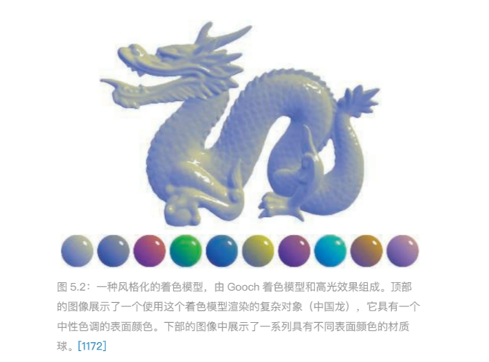

###5.1着色模型
####Gooch模型

- 输入
    - 表面法线n
    - 视线方向v
    - 光照方向l
- 计算
    - //颜色=高光色+(1-高光色)(暖色+(1-暖色)冷色)
    - $C~shader~=sC~highlight~+(1-s)(tC~warm~+(1-t)C~cool~)$
    - $C~cool~=(0,0,0.55)+0.25C~surface~$
    - $C~warm~=(0.3,0.3,0)+0.25C~surface~$
    - $C~highlight~(1,1,1)$
    - $t=\frac{(n*l)+1}{2}$
    - $r=2(n*l)n-l$ //l相对于n的反射方向 reflect()
    - $s=clamp((100(r*v)-97))$
    //线性插值函数lerp(),mix()

###5.2光照
- 计算
    - $C~shaderd=f~unlit(n,v)+\sum_{i=1}^{n}C~light~i~~f~lit(l~i~,n,v)$
    - $f~unlit~$表示完全不受光照的外观，可以是纯黑色或者其它风格化颜色

